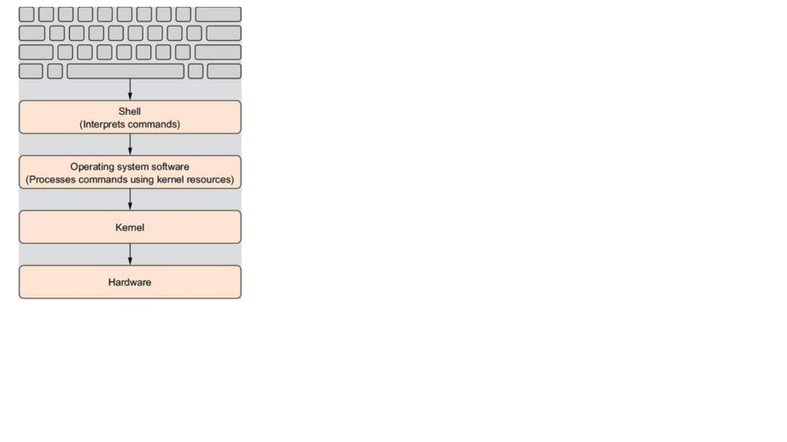

# Linux for Java developers

(##-1.-Brief-history-of-Linux)
(##-2.-Linux-Distributions)
(##-3.-Linux-Commands)
(##-4.-Linux-cheat-sheet)
(##-5.-References)

## 1. Brief history of Linux:

1.	 In the early 1960s, the first computing operating systems were designed to allow only a single user to run one program at a time.
     By the late 1960s, computing was becoming far more common and decided to develop **multi user, multi tasking operating system**. Bell Labs had been involved in a project called Multics (Multiplexed Information and Computing Service).

2.	 Multics was a combined effort of the Massachusetts Institute of Technology [MIT], Bell Labs, and General Electric to create multi user, multi task operating system. 
     However, the Multics project unable to achieve grand goals, and Bell Labs decided to pull out of the project. 
   
3.	 Visionary members in Bell labs Ken Thompson, Dennis Ritchie, Brian Kernighan, Douglas McElroy, and Joe Ossanna, decided to develop independent system based on Multics project
     concepts.  
  
4.   As a result, they developed multi user, multi task operating system called UNIX. 

5.   Later AT&T, the parent company of Bell labs started to provide the finical support to UNIX.

6.   During that time, all operating systems were written in assembly language. In 1972, UNIX was re-written entirely in the C programming language. Incidentally, C was also
     developed at Bell Labs, by some of the same team members who worked on the UNIX.  
 
7.	 The original name of the project was Unics, a play on the term Multics. 
  
8.	 AT&T, the parent company of Bell Labs, had been the target of an antitrust case. As part of the court ruling in that case, the company was prohibited from entering into the
     commercial computer business. So Bell Labs had to license the UNIX operating system to anyone who requested it, which led many educational institutions to adopt UNIX.
	 
9.   In the early `1980s`, AT&T broke up into smaller companies, allowing UNIX to become a commercial product.	 
   
### Unix Variants:

10.  Stallman had begun working on his own operating system in 1983. He called this system GNU (this acronym stands for GNU is Not UNIX). His goal was simply to create a free
     version of UNIX. He wanted it to be as much like UNIX as possible, despite the name (GNU is Not UNIX). However, Stallman’s open source UNIX variant did not achieve widespread popularity, and it was soon replaced by other, more robust, variants. 

11.  Open source was first brought to the public forefront by Richard Stallman. In 1985, Richard Stallman published a paper entitled “GNU Manifesto.” This document outlined the
     parameters for open source licensing, thus establishing **Stallman as the father of open source software**

12.	 Stallman’s Free Software Foundation later created the GNU General Public License that is now used for most open source products, including Linux.
	 
13.	 In 1987, a university professor named Andrew S. Tanenbaum created another UNIX variant called Minix. Minix was fairly stable and functional and a reasonably good UNIX clone.
     Minix was completely written in C by Professor Tanenbaum, who created it primarily as a teaching tool for his students. He wanted them to learn operating systems by being able to study the actual source code for an operating system. 

14.	 The source code for Minix was included in his book Operating Systems: Design and Implementation. Placing the source code in a textbook that was widely used meant a large number
     of computer science students would be exposed to this source code. Coupled with the earlier release of the original UNIX source code, many computer science students learned UNIX and UNIX clones quite thoroughly. This wide exposure to both the original UNIX source code and the source code for UNIX clones is one reason that most open source operating systems are UNIX clones.

15.	 Although Minix failed to gain the popularity of some other UNIX variants, it was an inspiration for the creator of Linux. 

16.	 The **story of the Linux operating system really is the story of Linus Torvalds**. He began his work on Linux when he was a graduate student working toward his Ph.D. in computer science. In those days, all computer science students worked with UNIX, as there was no Windows or DOS, and Apple was still very much a hobbyist machine. So Linus Torvalds was quite familiar with the UNIX operating system.
 
17.	 In addition to learning UNIX, Linus Torvalds was also introduced to the Minix operating system. Linus found many things he liked about the Minix operating system, but he believed that he could make a better UNIX variant. So he created his own UNIX clone and released it as free software. **He chose the name Linux, as a combination of his first name, Linus, and the end of UNIX, nix.**

18.	 Once his initial Linux project was underway, he had to address the issue of how to get it out to the public. He began by posting the operating system code on an Internet discussion board, allowing anyone to use it, play with it, or modify it. 

19.	 Finally, Linus Torvalds released **`Linux 0.01`** on the Internet under a GNU public license. Since it was open source, this meant other computer scientists and programmers had access to the source code. That allowed people all over the world to become involved in Linux and to contribute to its development.

20.	 Over the ensuing years, Linux popularity has grown. It has moved from a hobby operating system for computer enthusiasts to a full-fledged business operating system. 

21.	 Various vendors, including companies and individuals, take the Linux kernel and add their own nuances. These nuances may include additional applications, different installation processes, and even different targets. For example, Red Hat works to create a Linux distribution that is well suited to large scale servers, whereas Ubuntu and Kubuntu are both targeted for novice users installing on a single workstation. 

22.	 The Linux mascot, has a funny history behind it. The community was looking for a logo/mascot, and after several suggestions, Linus talked about being bitten by a "ferocious fairy" penguin in an Australian zoo in 1993. Thus it was settled. Larry Ewing made the original drawing. The name Tux came from **T**orvalds **U**NI**X**, and it's also the beginning of the word tuxedo (frequently associated with penguins).

        
        
        
        
## 2. Linux Distributions:

1.   Since Linux is open source many people code and released their own versions of Linux. Currently in market there are many Linux distros available. Linux distros rating can be found at  http://distrowatch.com

2.   Linux Distro is set of components required to achieve successful working Linux system

3.   A Linux distro includes the Linux kernel itself (different versions of the kernel may be integrated into the same distro for different hardware architectures, for example), the omnipresent GNU tools, a lot of small tools that are needed to provide different services, probably a windowing system, a desktop environment, and finally a package management system with a number of software packages that can be installed by default or according to user preferences. Even when the entire installation process can be completed (more or less) through the automated distro installation process, as opposed to other operating systems, the Linux OS installation is highly customizable.

## 3. Linux Commands:

1.   A shell is any user interface that interprets a user's commands, either through a command-line interface (CLI) or a graphical user interface (GUI). You can think of a shell (visualized in the figure) as a software layer meant to execute all appropriately formatted commands using the underlying kernel and hardware system resources. In other words, it's the way you talk to your computer.

        
        
2.	 **BASH** is default command line tool in Linux, whereas **sh** is default command line tool in Unix. Other popular command line tools are **C shell, Z shell [Z sh]** 

3.	 Use below command to find out the shells installed in Linux
     **cat /etc/shells**

4.	 Most Linux distributions include an online manual for looking up information on shell commands. 

5.	 The **man** command provides access to the manual pages stored on the Linux system. Entering the man command followed by a specific command name provides that utility's manual

     **Example**:   man pwd
     
     Below screenshot shows above command output
     
            

6.	The bash manual is not a step-by-step guide, but instead a quick reference.
    
    Tip: 
    The bash manual even has reference information on itself. Type man man to see manual pages concerning the man pages.

7.	The manual page divides information about a command into separate sections. Each section has a conventional naming standard as shown in below table

            
    
    
    Tip: 
    Not every command's man page has all the section names described in above table. Also, some commands have section names that are not listed in the conventional standard.

    Tip: 
    What if you can't remember the command name? You can search the man pages using keywords. The syntax is man -k keyword. For example, to find commands dealing with the terminals, you type man -k terminal.

8.	In addition to the conventionally named sections for a man page, there are man page section areas. Each section area has an assigned number, starting at 1 and going to 9; they are listed in below table. 

                

9.	For example, screenshot shown on point-5. Notice that in the upper-left and upper-right display corners, the word PWD is followed by a number in parentheses, (1). This means the man pages displayed are coming from content area 1 (executable programs or shell commands).

References:
==================
Linux Command Line and Shell Scripting Bible, Third Edition
The Linux Command Line: A Complete Introduction, 2nd Edition
Introduction to UNIX/Linux  -   Cengage Charles River Media

